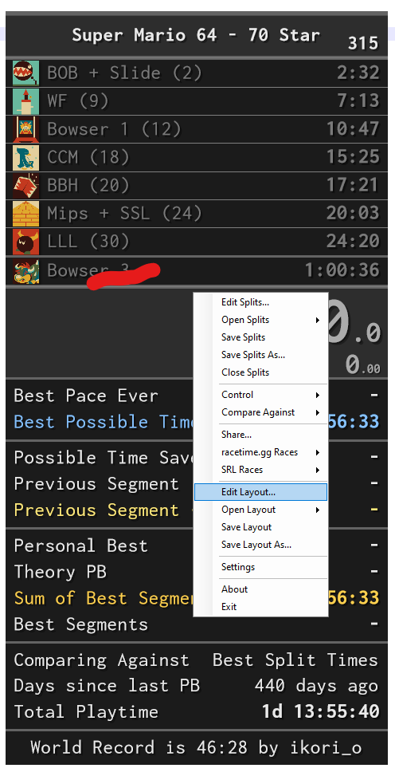
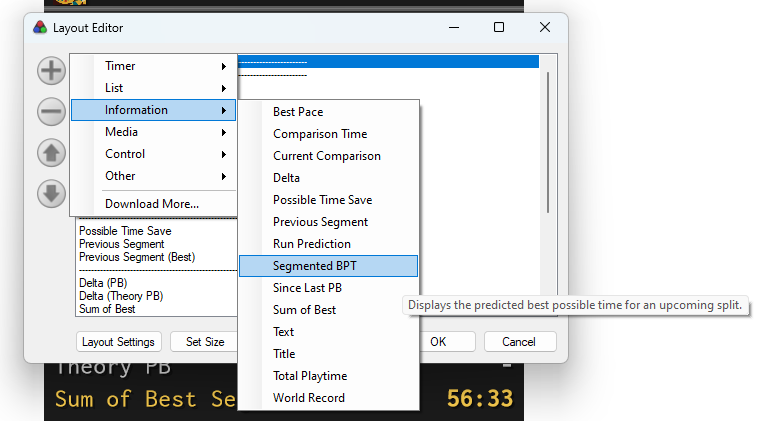
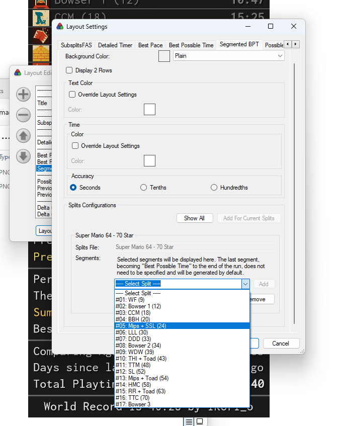
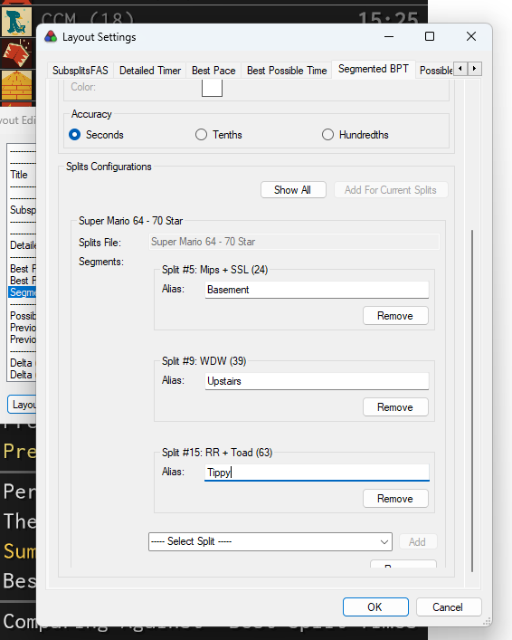
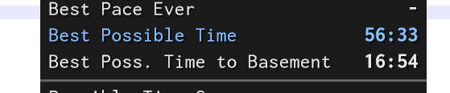

LiveSplit.SegmentedBPT
======================

>> NOTE: THIS IS A MEGA BETA COMPONENT, USE AT YOUR OWN RISK ONLY IF YOU HAVE A WAY TO CONTACT ME TO REPORT BUGS PROBABLY.

# How to Install and Configure?

Step 1: Drop the DLL into your components directory.
Step 2: Edit Layout

Step 3: Add to Layout, you will find it under "Information" > "Segmented BPT"

Step 4: Click "Layout Settings" and go to the "Segmented BPT" tab. Click "Add For Current Splits".
Step 5: Select a split that starts a segment in the dropdown, for instance "SSL" starts the "Basement" segment in this run. Click "Add".

Step 6: Configure all the relevant segments, give them aliases if required.

Step 7: Save Layout, you are done, it should now show the BPT to that segment instead of the end of the run. BPT will be displayed after the last segment has been reached.

# BPT Flashing

In order to display both Segmented BPT and BPT to the end of the run, the layout will flash BPT after each split. There is two modes available,
default mode and continuous mode. Along with two timers to configure the flashing.

Here is how it works:

- In default mode: Segmented BPT is the default thing displayed by the plugin. When a split happens, the Segmented BPT will keep displaying
  for its configured time, then BPT to the end of the run will display for its configured time, finally the plugin will go back to displaying
  the Segmented BPT until the next time a split happens.
- In continuous mode: Segmented BPT will show for its configured time, then BPT to the end of the run will show for its configured time. This
  will loop forever. The cycle is reset on every split.

# Known Issues

- The color pickers do not currently work.
- There is some weird cutoff and scrolling happening in the layout. Sometimes clicking "show/add all" fixes this.